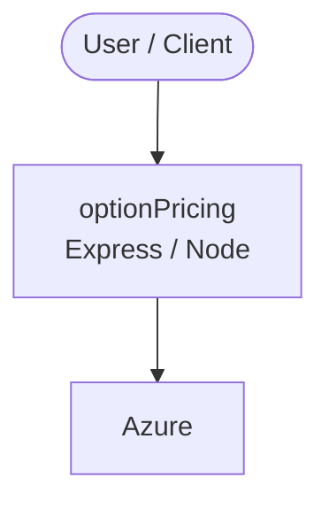

# Context Map — `optionPricing`

> Auto-generated architecture & deployment context map. Summarizes the core application, container/cloud footprint, and database connections. Regenerate after significant structural changes.

**Repo:** `avnit/optionPricing` · **Original** · Public · Primary language: CSS · Default branch: `master` · Files: 665

**Description:** The option price calculator

## 1. Core application

Hired1 Marketing Plan ( Business Services )

- **Frameworks / runtime:** Express / Node

## 2. Containers & cloud applications

**Detected cloud platforms / services:** Azure, Vercel

## 3. Database connections

_No database drivers or connection strings detected._

## 4. Architecture diagram

## 5. Security posture

- **Static scan findings:** 2 high, 25 medium

| Severity | Rule | File:Line |
|---|---|---|
| high | js-eval | `src/optionPricing/wwwroot/lib/underscore/underscore-min.js:5` |
| high | js-eval | `src/optionPricing/wwwroot/lib/underscore/underscore.js:1454` |
| medium | js-innerhtml | `src/optionPricing/wwwroot/lib/jqwidgets/jqwidgets/jqxcalendar.js:7` |
| medium | js-innerhtml | `src/optionPricing/wwwroot/lib/jqwidgets/jqwidgets/jqxcombobox.js:7` |
| medium | js-innerhtml | `src/optionPricing/wwwroot/lib/jqwidgets/jqwidgets/jqxcore.js:7` |
| medium | js-innerhtml | `src/optionPricing/wwwroot/lib/jqwidgets/jqwidgets/jqxdata.export.js:7` |
| medium | js-innerhtml | `src/optionPricing/wwwroot/lib/jqwidgets/jqwidgets/jqxdatatable.js:7` |
| medium | js-innerhtml | `src/optionPricing/wwwroot/lib/jqwidgets/jqwidgets/jqxdatetimeinput.js:7` |

---
_Generated by repo context-mapping pass on 2026-08-13._